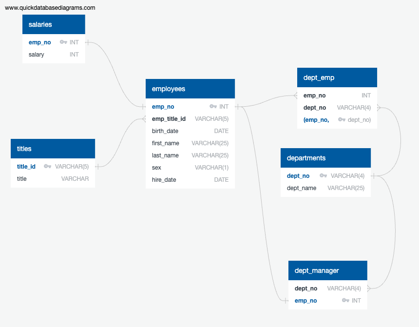

# Pewlett Hackard Employee Database Analysis
## Overview
This repository offers an analysis of Pewlett Hackard's employee database, primarily focusing on individuals employed during the 1980s and 1990s. Through the process of data modeling, engineering, and analysis, this project seeks to derive insights from six provided CSV files.

## Prerequisites:
- SQL (PostgreSQL)
  
- A tool for ERD sketching like QuickDBD

## Data Files
The project employs six CSV files, which can be found in the Resources directory.

## Project Structure
The investigation and analysis is compartmentalized into:

- **Data Modeling:**
ERD sketching, with the help of tools such as QuickDBD.

- **Data Engineering:**
Schema creation for each CSV file with consideration to data types, keys, and other constraints.
Data importation from the CSVs into respective SQL tables.
- **Data Analysis:**
Queries to derive insights such as employee details, recruitment specifics, departmental breakdowns, and more.

